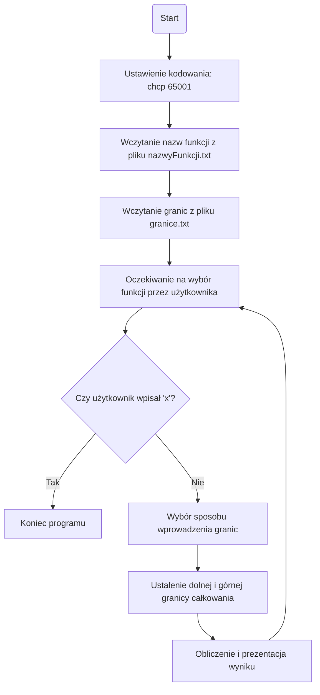
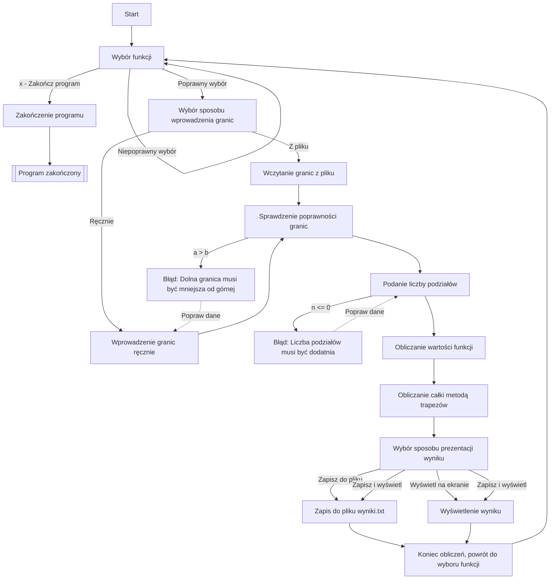

# Metoda trapezów w C++. 
Projekt i implementacja programu obliczającego całkę złożoną metodą trapezów. 

# Treść dokumentacji
* [Tematy dokumentacji](#tematy-dokumentacji)
* [Sformułowanie zadania](#sformułowanie-zadania)
* [Opis problemu](#opis-problemu)
* [Porównanie wyników](#porównanie-wyników)
* [Schematy blokowe](#schematy-blokowe)
* [Instrukcja programu](#instrukcja-programu)
* [Przykłady działania](#przykłady-działania)
* [Żródła](#źródła)
    
## Sformułowanie zadania
Celem programu jest obliczenie wartości całki oznaczonej wybranej funkcji za pomocą metody trapezów. Użytkownik może wybrać jedną z dostępnych funkcji matematycznych oraz sposób wprowadzenia granic całkowania – ręcznie lub z pliku. Wynik obliczeń może być wyświetlony na ekranie, zapisany do pliku lub obie opcje mogą zostać wykonane jednocześnie.

## Opis problemu
Metoda trapezów to numeryczna metoda obliczania całek oznaczonych. Całka oznaczona funkcji f(x) w przedziale [a, b] jest aproksymowana sumą pól trapezów, na które dzielimy ten przedział.

Wzór na metodę trapezów:

gdzie:

$$
h = \frac{b - a}{n}
$$

-długość podprzedziału.

- n – liczba podziałów,

$$
x_i = a+i⋅h
$$

-punkty podziału przedziału.

## Metoda trapezów dla funkcji \( f(x) = x^2 + 2x + 1 \)

Funkcja:

$$
f(x) = x^2 + 2x + 1
$$

w przedziale \([0,3]\) za pomocą metody trapezów dla \( n=4 \) (podział na 4 przedziały).

### Krok 1: Obliczenie długości podziału

$$
h = \frac{b - a}{n} = \frac{3 - 0}{4} = 0.75
$$

### Krok 2: Wyznaczenie wartości funkcji w punktach podziału

**Punkty podziału:**

$$
x_0 = 0, \quad x_1 = 0.75, \quad x_2 = 1.5, \quad x_3 = 2.25, \quad x_4 = 3
$$

**Obliczamy wartości funkcji \( f(x) = x^2 + 2x + 1 \) w tych punktach:**

$$
f(0) = 0^2 + 2(0) + 1 = 1
$$

$$
f(0.75) = (0.75)^2 + 2(0.75) + 1 = 3.3125
$$

$$
f(1.5) = (1.5)^2 + 2(1.5) + 1 = 6.25
$$

$$
f(2.25) = (2.25)^2 + 2(2.25) + 1 = 9.8125
$$

$$
f(3) = 3^2 + 2(3) + 1 = 13
$$

### Krok 3: Podstawienie do wzoru

$$
I \approx \frac{h}{2} \left( f(0) + 2(f(0.75) + f(1.5) + f(2.25)) + f(3) \right)
$$

$$
I \approx \frac{0.75}{2} \left( 1 + 2(3.3125 + 6.25 + 9.8125) + 13 \right)
$$

$$
I \approx \frac{0.75}{2} \left( 1 + 2 \times 19.375 + 13 \right)
$$

$$
I \approx \frac{0.75}{2} \times (1 + 38.75 + 13)
$$

$$
I \approx \frac{0.75}{2} \times 52.75
$$

$$
I \approx 19.78125
$$

**Wynik: 19.78**

Czyli wartość całki oznaczonej:

$$
\int_{0}^{3} (x^2 + 2x + 1)dx
$$

oszacowana metodą trapezów dla \( n=4 \) wynosi **19.78**.

## Porównanie wyników

| Funkcja | Całka analityczna | Metoda trapezów (*n* = 100) | Błąd |
|---------|-------------------|---------------------|------|
| a ∫₋₁¹ 2 dx | 4 | 4.0 | 0.0 |
| b ∫₀³ (x² + 2x + 1) dx | 21 | 21.0005 | 0.0005 |
| c ∫₀² x³ dx | 4 | 4.00044 | 0.00044 |
| d ∫₀ˡⁿ² 4eˣ dx | 4 | 4.00002 | 0.00002 |
| e ∫₀π/₂ cos x dx | 1 | 0.999979 | 0.000021 |
| f ∫₀π (cos x + sin x) dx | 2 | 1.99984 | 0.00016 |
| g ∫₀π x sin x dx | π ≈ 3.1416 | 3.14133 | 0.00027 |

## Schematy blokowe
- Main

- Funk

## Instrukcja programu
1. Uruchomienie programu
Program należy skompilować i uruchomić w konsoli.

2. Wybór funkcji
Po uruchomieniu programu użytkownik wybiera funkcję spośród podanych w menu (a-g).

3. Określenie granic całkowania
Użytkownik może:
- Wczytać granice z pliku
- Wprowadzić granice ręcznie

4. Podanie liczby podziałów
Użytkownik podaje liczbę przedziałów (musi być dodatnia).

5. Obliczenie całki metodą trapezów
Program oblicza wartość całki dla wybranej funkcji i zadanych parametrów.

6. Prezentacja wyników
Użytkownik wybiera sposób prezentacji wyniku:
- Zapis do pliku
- Wyświetlenie na ekranie
- Obie opcje

7. Powtórzenie procesu lub zakończenie programu
Użytkownik może powtórzyć proces lub zakończyć program

## Przykłady działania
### Wybranie funkcji
Przed:

Po:

### Wybór wprowadzenia granic całkowania
Przed:

Po:

### Wprowadzenie podziałów(n)
Przed:

Po:

### Wybór sposobu wyświetlania wyników
Przez:

Po:

## Źródła
- Visual Studio Code version: 1.96.4
https://code.visualstudio.com/

- gcc (Rev3, Built by MSYS2 project) 13.2.0
https://code.visualstudio.com/docs/cpp/config-mingw

    ### Lekcje cpp 
-   https://www.learncpp.com/
-	https://cplusplus.com/doc/tutorial/
-	https://www.youtube.com/watch?v=-TkoO8Z07hI

    ### Książka o cpp
-   https://books.goalkicker.com/CPlusPlusBook/

    ### Metoda trapezów
-   [https://www.mathros.net.ua/](https://www.mathros.net.ua/obchyslennja-vyznachenyh-integraliv-metodom-trapecij.html)

    ### Obliczenia analityczne
-	https://www.wolframalpha.com/

    ### Schemat blokowy
-   https://www.mermaidchart.com/
