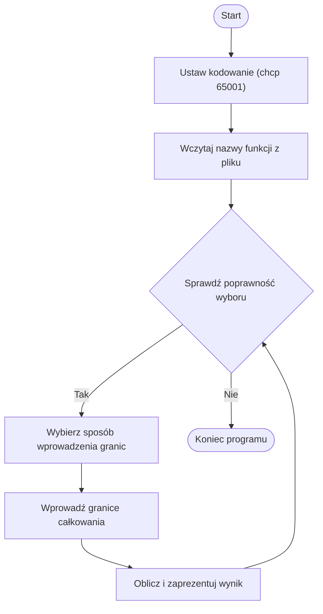
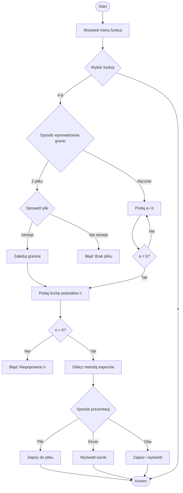

# Metoda trapezów w C++. 
Projekt i implementacja programu obliczającego całkę złożoną metodą trapezów. 

# Treść dokumentacji
* [Tematy dokumentacji](#tematy-dokumentacji)
* [Sformułowanie zadania](#sformułowanie-zadania)
* [Opis problemu](#opis-problemu)
* [Porównanie wyników](#porównanie-wyników)
* [Schematy blokowe](#schematy-blokowe)
* [Instrukcja programu](#instrukcja-programu)
* [Przykłady działania](#przykłady-działania)
* [Żródła](#źródła)
    
## Sformułowanie zadania
Celem programu jest obliczenie wartości całki oznaczonej wybranej funkcji za pomocą metody trapezów. Użytkownik może wybrać jedną z dostępnych funkcji matematycznych oraz sposób wprowadzenia granic całkowania – ręcznie lub z pliku. Wynik obliczeń może być wyświetlony na ekranie, zapisany do pliku lub obie opcje mogą zostać wykonane jednocześnie.

## Opis problemu
Metoda trapezów to numeryczna metoda obliczania całek oznaczonych. Całka oznaczona funkcji f(x) w przedziale [a, b] jest aproksymowana sumą pól trapezów, na które dzielimy ten przedział.

Wzór na metodę trapezów:

gdzie:
* 
-długość podprzedziału.

- n – liczba podziałów,
- xi=a+i⋅h – punkty podziału przedziału.

### Przykład rozwiązania
Obliczmy przybliżoną wartość całki oznaczonej dla funkcji:

w przedziale [0,3] za pomocą metody trapezów dla n=4 (podział na 4 przedziały).

Krok 1: Obliczenie długości podziału

Krok 2: Wyznaczenie wartości funkcji w punktach podziału

Punkty podziału:

Krok 3: Podstawienie do wzoru

Wynik: I~19.78

Czyli wartość całki oznaczonej

oszacowana metodą trapezów dla n=4 wynosi 19.78.

## Porównanie wyników

## Schematy blokowe
- Main

- Funk

## Instrukcja programu
1. Uruchomienie programu
Program należy skompilować i uruchomić w konsoli.

2. Wybór funkcji
Po uruchomieniu programu użytkownik wybiera funkcję spośród podanych w menu (a-g).

3. Określenie granic całkowania
Użytkownik może:
- Wczytać granice z pliku
- Wprowadzić granice ręcznie

4. Podanie liczby podziałów
Użytkownik podaje liczbę przedziałów (musi być dodatnia).

5. Obliczenie całki metodą trapezów
Program oblicza wartość całki dla wybranej funkcji i zadanych parametrów.

6. Prezentacja wyników
Użytkownik wybiera sposób prezentacji wyniku:
- Zapis do pliku
- Wyświetlenie na ekranie
- Obie opcje

7. Powtórzenie procesu lub zakończenie programu
Użytkownik może powtórzyć proces lub zakończyć program

## Przykłady działania
### Wybranie funkcji
Przed:

Po:

### Wybór wprowadzenia granic całkowania
Przed:

Po:

### Wprowadzenie podziałów(n)
Przed:

Po:

### Wybór sposobu wyświetlania wyników
Przez:

Po:

## Źródła
- Visual Studio Code version: 1.96.4
https://code.visualstudio.com/

- gcc (Rev3, Built by MSYS2 project) 13.2.0
https://code.visualstudio.com/docs/cpp/config-mingw

-   https://www.learncpp.com/
-	https://cplusplus.com/doc/tutorial/
-   https://www.mathros.net.ua/
-	https://www.wolframalpha.com/
-   https://books.goalkicker.com/CPlusPlusBook/
-   https://chatgpt.com/
